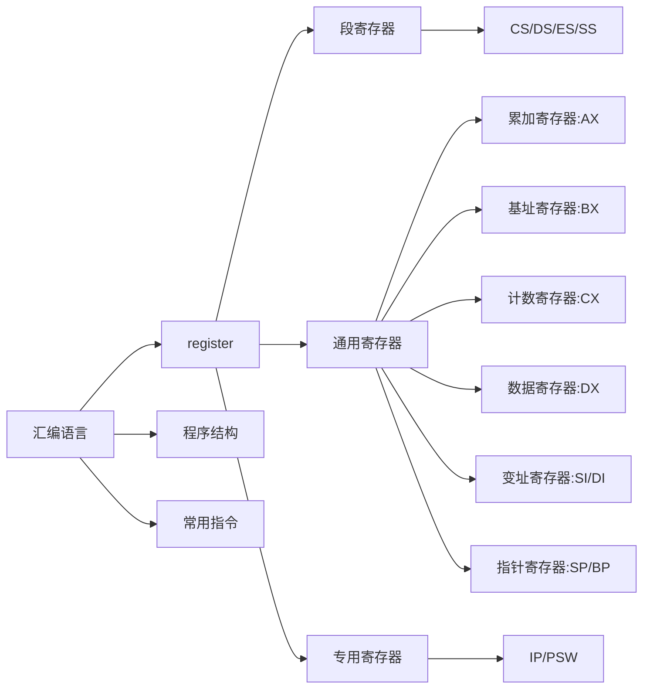

```mermaid
graph LR
汇编语言 --> register
register --> 段寄存器 --> CS/DS/ES/SS
register --> 通用寄存器 
通用寄存器 --> 累加寄存器:AX
通用寄存器 --> 基址寄存器:BX
通用寄存器 --> 计数寄存器:CX
通用寄存器 --> 数据寄存器:DX
通用寄存器 --> 变址寄存器:SI/DI
通用寄存器 --> 指针寄存器:SP/BP
register --> 专用寄存器 --> IP/PSW

汇编语言 --> 程序结构
汇编语言 --> 常用指令
```

## 书单

汇编语言，王爽

## 笔记

