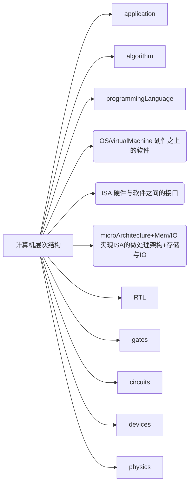

```mermaid
graph LR
计算机层次结构 --> application
计算机层次结构 --> algorithm
计算机层次结构 --> programmingLanguage
计算机层次结构 --> OS/virtualMachine(OS/virtualMachine 硬件之上的软件)
计算机层次结构 --> ISA(ISA 硬件与软件之间的接口)
计算机层次结构 --> microArchitecture+Mem&IO(microArchitecture+Mem/IO 实现ISA的微处理架构+存储与IO)
计算机层次结构 --> RTL
计算机层次结构 --> gates
计算机层次结构 --> circuits
计算机层次结构 --> devices
计算机层次结构 --> physics
```

