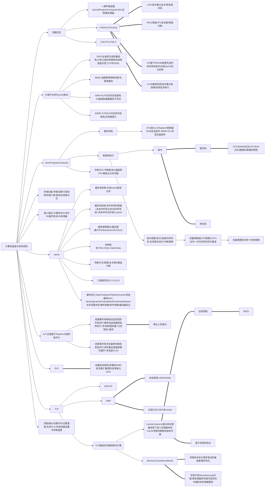

# 计算机组成与体系结构

[01.前言-CA_CO_微机原理与接口](01.前言-CA_CO_微机原理与接口.md)

[02.体系结构的发展1-早期时代](02.体系结构的发展1-早期时代.md)

[03.体系结构的发展2-RISC_ILP_Cache](03.体系结构的发展2-RISC_ILP_Cache.md)

[04.体系结构的发展3-DLP_TLP_RLP](04.体系结构的发展3-DLP_TLP_RLP.md)

[05.计算平台的Flynn分类法md](05.计算平台的Flynn分类法md.md)

[06.体系结构研究对象-ISA](06.体系结构研究对象-ISA.md)

[07.StoredProgramComputer-结构与功能](07.StoredProgramComputer-结构与功能.md)

[08.StoredProgramComputer-指令的取和执行](08.StoredProgramComputer-指令的取和执行.md)

[09.StoredProgramComputer-中断与IO](09.StoredProgramComputer-中断与IO.md)

[10.StoredProgramComputer-系统互连_总线](10.StoredProgramComputer-系统互连_总线.md)

[11.存储设备-概述](11.存储设备-概述.md)

[12.存储设备-RAM](12.存储设备-RAM.md)

[13.存储设备-ROM](13.存储设备-ROM.md)

[14.存储设备-磁盘](14.存储设备-磁盘.md)

[15.存储设备-磁盘接口](15.存储设备-磁盘接口.md)

[16.存储设备-磁盘-访问优化](16.存储设备-磁盘-访问优化.md)

[17.存储设备-磁盘阵列RAID](17.存储设备-磁盘阵列RAID.md)

[18.输入输出-IO模块与IO寻址](18.输入输出-IO模块与IO寻址.md)

[19.输入输出-IO操作技术](19.输入输出-IO操作技术.md)

[20.输入输出-IO通道和IO处理器](20.输入输出-IO通道和IO处理器.md)

[21.cache原理-时间空间的局部性](21.cache原理-时间空间的局部性.md)

[22.cache原理-缓存的读与写](22.cache原理-缓存的读与写.md)

[23.cache原理-缓存替换算法](23.cache原理-缓存替换算法.md)

[24.cache-存储结构与映射方式](24.cache-存储结构与映射方式.md)

[25.cache-三级缓存设计](25.cache-三级缓存设计.md)

[26.cache-缓存优化技术](26.cache-缓存优化技术.md)

[27.ILP-指令集并行](27.ILP-指令集并行.md)

[28.DLP-数据级并行](28.DLP-数据级并行.md)

[29.TLP-线程级并行](29.TLP-线程级并行.md)

[30.TLP-CacheCoherent](30.TLP-CacheCoherent.md)

[31.TLP-MemoryModel](31.TLP-MemoryModel.md)

[32.性能指标-机器字长与OS位数](32.性能指标-机器字长与OS位数.md)

[33.性能指标-衡量计算机性能的因素](33.性能指标-衡量计算机性能的因素.md)

