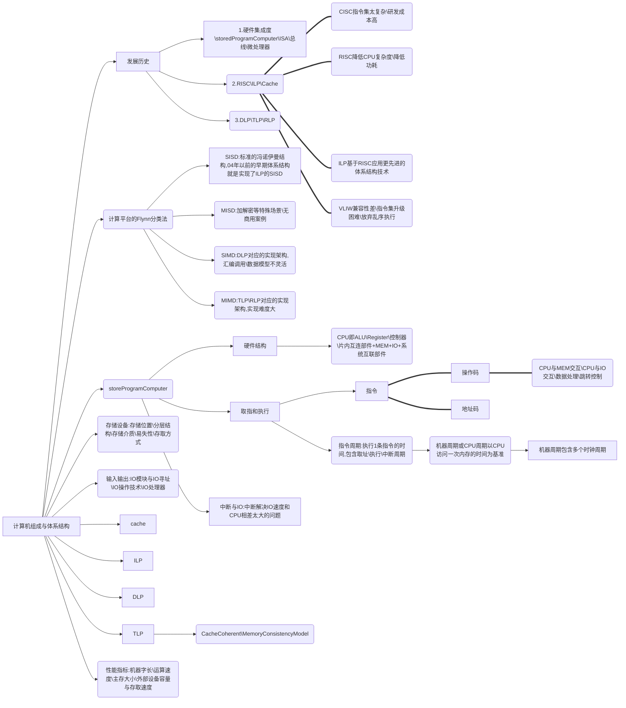

# 计算机组成与体系结构

[01.前言-CA_CO_微机原理与接口](01.前言-CA_CO_微机原理与接口.md)

[02.体系结构的发展1-早期时代](02.体系结构的发展1-早期时代.md)

[03.体系结构的发展2-RISC_ILP_Cache](03.体系结构的发展2-RISC_ILP_Cache.md)

[04.体系结构的发展3-DLP_TLP_RLP](04.体系结构的发展3-DLP_TLP_RLP.md)

[05.计算平台的Flynn分类法md](05.计算平台的Flynn分类法md.md)

[07.体系结构研究对象-ISA](07.体系结构研究对象-ISA.md)

[08.StoredProgramComputer-结构与功能](08.StoredProgramComputer-结构与功能.md)

[09.StoredProgramComputer-指令的取和执行](09.StoredProgramComputer-指令的取和执行.md)

[10.StoredProgramComputer-中断与IO](10.StoredProgramComputer-中断与IO.md)

[11.StoredProgramComputer-系统互连_总线](11.StoredProgramComputer-系统互连_总线.md)

[12.性能指标-机器字长与OS位数](12.性能指标-机器字长与OS位数.md)

[13.性能指标-衡量计算机性能的因素](13.性能指标-衡量计算机性能的因素.md)

[14.存储设备-概述](14.存储设备-概述.md)

[15.存储设备-RAM](15.存储设备-RAM.md)

[16.存储设备-ROM](16.存储设备-ROM.md)

[17.存储设备-磁盘](17.存储设备-磁盘.md)

[18.存储设备-磁盘接口](18.存储设备-磁盘接口.md)

[19.存储设备-磁盘-访问优化](19.存储设备-磁盘-访问优化.md)

[20.存储设备-磁盘阵列RAID](20.存储设备-磁盘阵列RAID.md)

[21.输入输出-IO模块与IO寻址](21.输入输出-IO模块与IO寻址.md)

[22.输入输出-IO操作技术](22.输入输出-IO操作技术.md)

[23.输入输出-IO通道和IO处理器](23.输入输出-IO通道和IO处理器.md)

[24.cache原理-时间空间的局部性](24.cache原理-时间空间的局部性.md)

[25.cache原理-缓存的读与写](25.cache原理-缓存的读与写.md)

[26.cache原理-缓存替换算法](26.cache原理-缓存替换算法.md)

[27.cache-存储结构与映射方式](27.cache-存储结构与映射方式.md)

[28.cache-三级缓存设计](28.cache-三级缓存设计.md)

[29.cache-缓存优化技术](29.cache-缓存优化技术.md)

[30.ILP-指令集并行](30.ILP-指令集并行.md)

[31.DLP-数据级并行](31.DLP-数据级并行.md)

[32.TLP-线程级并行](32.TLP-线程级并行.md)

[33.TLP-CacheCoherent](33.TLP-CacheCoherent.md)

[34.TLP-MemoryModel](34.TLP-MemoryModel.md)

