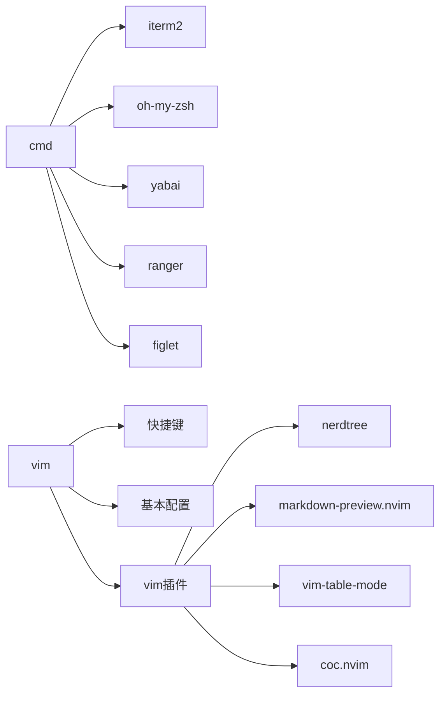

```mermaid
graph LR
cmd --> iterm2
cmd --> oh-my-zsh
cmd --> yabai
cmd --> ranger
cmd --> figlet
vim --> 快捷键
vim --> 基本配置
vim --> vim插件
vim插件 --> nerdtree
vim插件 --> markdown-preview.nvim
vim插件 --> vim-table-mode
vim插件 --> coc.nvim
```
