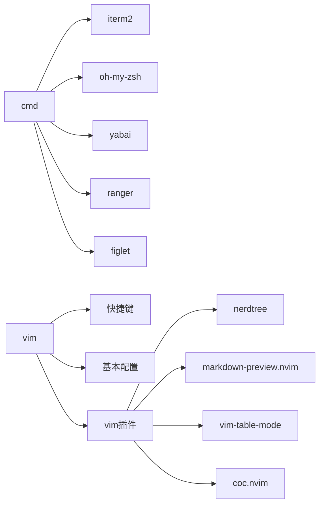

# cmd_vim

[01.cmd-iterm2](01.cmd-iterm2.md)

[02.cmd-oh-my-sh](02.cmd-oh-my-sh.md)

[03.cmd-yabai](03.cmd-yabai.md)

[04.cmd-ranger](04.cmd-ranger.md)

[05.cmd-figlet](05.cmd-figlet.md)

[06.vim-快捷键](06.vim-快捷键.md)

[07.vim-常用配置](07.vim-常用配置.md)

[08.vim-保存只读模式修改](08.vim-保存只读模式修改.md)

[09.vim-为什么自动添加行结束符](09.vim-为什么自动添加行结束符.md)

[10.vim-为一段文本添加行号](10.vim-为一段文本添加行号.md)

[11.vim-保存html文件](11.vim-保存html文件.md)

[12.vim插件-nerdtree文件目录树](12.vim插件-nerdtree文件目录树.md)

[13.vim插件-vimwiki](13.vim插件-vimwiki.md)

[14.vim插件-markdown插件](14.vim插件-markdown插件.md)

[15.vim插件-coc代码补全](15.vim插件-coc代码补全.md)

